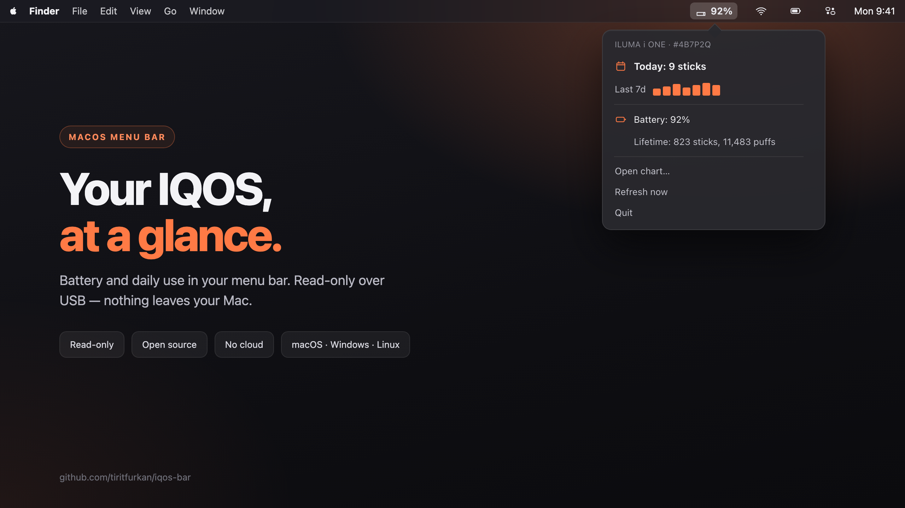
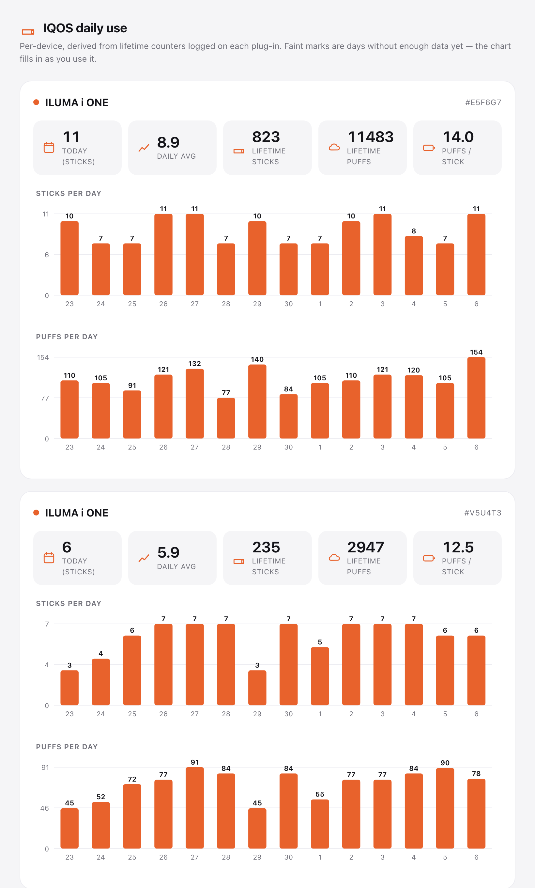

# IQOS Bar



A small menu bar / system tray app that shows your IQOS battery charge and how
many sticks you smoke per day, read over the USB cable. It logs the device's
lifetime counters whenever you plug in and charts the daily difference.

Runs on macOS (menu bar), Windows and Linux (system tray). Everything stays on
your machine — it only reads from the device, never writes to it.



## What it shows

- Battery charge, next to the menu bar icon (macOS) or drawn into the tray icon (Windows/Linux).
- Today's stick count and the last 7 days in a popover panel (macOS) or the tray menu.
- A dashboard (Open chart…) with sticks/day and puffs/day per device.
- Lifetime sticks, puffs and usage time.

The device only keeps lifetime totals, so per-day numbers come from logging
those totals over time and subtracting. The chart needs a couple of days of
use before it fills in.

## Supported devices

Verified on the **IQOS ILUMA i ONE**. Other models are read with the same
commands; fields the model doesn't expose just show up blank, and nothing is
written to the device either way. If you have another model, a dump from
`tools/dump.py` in an issue helps add support — see [PROTOCOL.md](PROTOCOL.md).

## Install

```bash
git clone https://github.com/tiritfurkan/iqos-bar.git
cd iqos-bar
python3 -m venv venv
# macOS/Linux:
source venv/bin/activate
# Windows:
venv\Scripts\activate

pip install -r requirements.txt
python -m iqosbar
```

The IQOS icon shows up in your menu bar (macOS) or tray (Windows/Linux). Plug
in the device and the numbers appear in a few seconds.

On Linux you may need a tray backend — `gir1.2-appindicator3` on GNOME, for
example.

### Read it from the terminal

```bash
python -m iqosbar.reader
```

## How it works

The device enumerates as a plain USB HID device (`2759:0003`), so no driver is
needed. IQOS Bar sends read-only register queries and parses the replies —
battery, temperature, and the lifetime stick/puff counters. The framing and the
register map are in [PROTOCOL.md](PROTOCOL.md).

History lives in `~/.iqosbar/history.jsonl`.

```
iqosbar/
  reader.py    device I/O + protocol
  history.py   per-device history
  chart.py     HTML dashboard
  core.py      shared poll + formatting
  icon.py      glyph + tray icon
  panel.py     macOS popover panel (HTML)
  ui_mac.py    macOS menu bar + popover (PyObjC)
  ui_win.py    Windows/Linux tray (pystray)
  __main__.py  picks the UI for your OS
```

## Credits

The USB register protocol was figured out by
[iqos-scope](https://github.com/SabriEzzine/iqos-scope), a WebHID dashboard for
the same device. IQOS Bar reuses it to build a native menu bar / tray app. The
`iqosctl` and `iqos_cli` projects were a useful reference for the BLE side.

## Author

Furkan Tirit — [github.com/tiritfurkan](https://github.com/tiritfurkan) ·
furkan@furkantirit.com

## Disclaimer

Not affiliated with or endorsed by Philip Morris International. "IQOS" is a
trademark of its owner. This app only reads diagnostic data; it does not modify
the device. Use at your own risk.

## License

MIT — see [LICENSE](LICENSE).
